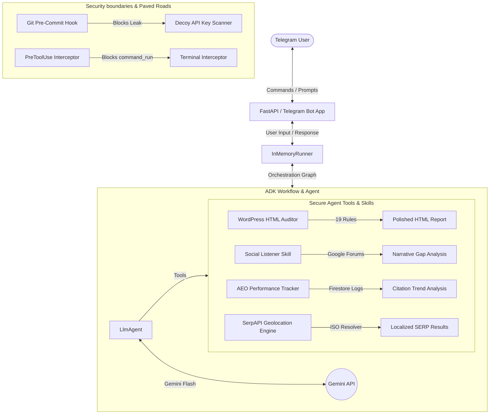

# Gutenberg AEO Copilot
> **Autonomous WordPress SEO & Answer Engine Optimization (AEO) Auditor**

Gutenberg AEO Copilot is an autonomous agent built using the **Google Agent Development Kit (ADK) 2.0**. It helps modern publishers optimize their content for both traditional search engines (SEO) and generative search engines (Answer Engine Optimization / AEO, such as Google AI Overviews / SGE).

This project was built as a Capstone Project for the **5-Day AI Agents Intensive Vibe Coding Course with Google**.

---

## System Architecture



---

## Key Features & Concepts Demonstrated

### 1. Spec-Driven Orchestration (Day 1 & Day 5)
* Utilizes the `google-adk` framework's `Workflow` and `Edge` graph classes.
* Implements thread-safe in-memory state locks (`threading.Lock`) to manage state-modifying tools safely during parallel user Telegram polling sessions.

### 2. Custom Model Context Protocol (MCP) Tools & Geolocation (Day 2)
* Built-in multi-tiered location resolution engine that parses country-specific ccTLDs (like `.co.uk`, `.com.ng`, `.ca`), queries the Google Knowledge Graph to resolve headquarters addresses, and resolves search regions dynamically.
* Supports autocomplete, Google Maps geocoding, SGE page token tracking, and AI Overview Mode.

### 3. Custom Agent Skills (Day 3)
* **seo-auditor**: Enforces structured rules for auditing HTML heading hierarchies and image alt tags on crawled web pages.
* **manage-aeo-custom-blocks**: Guides the agent on how to format AEO custom Gutenberg blocks (like Hero and FAQ cards) and call the WordPress page generator.
* **automation-roi-parameters**: Integrates guidelines for measuring search value and AEO return-on-investment parameters.

### 4. Enterprise-Grade Security Paved Roads (Day 4)
* **Pre-Commit Hook**: Integrates a local Git hook scanning for hardcoded secrets and API keys using custom Semgrep rules. Includes a Windows-compatible native Python launcher shim inside `.venv`.
* **IDE Gating Hook**: Implements `PreToolUse` hooks (`hooks.json` & `validate_tool_call.py`) to intercept `run_command` calls and prevent dangerous commands (like `rm -rf` or `format c:`) from running inside the terminal sandbox.

### 5. Polished Dashboard Reports (UX)
* Compiles WordPress page audits into a premium, responsive dark-mode dashboard HTML report mirroring the layout of premium testimonial slider cards with rounded left-hand severity tags, soft status glows, and Inter/Outfit typography.

---

## Installation & Setup

### Prerequisites
* Python 3.10+
* Git

### Step-by-Step Installation

1. Clone the repository:
   ```bash
   git clone https://github.com/cephasoo/adk-aeo-20.git
   cd adk-aeo-20
   ```

2. Initialize your local virtual environment:
   ```bash
   python -m venv .venv
   .venv\Scripts\activate      # On Windows
   source .venv/bin/activate   # On macOS/Linux
   ```

3. Install dependencies in editable mode:
   ```bash
   pip install -e .
   ```

4. Configure environment variables inside `.env`:
   ```ini
   # Model Credentials
   GEMINI_API_KEY="your_gemini_api_key"
   GEMINI_MODEL="gemini-3.5-flash"
   GOOGLE_CLOUD_PROJECT="your_google_cloud_project_id"

   # Telegram Bot Credentials
   TELEGRAM_BOT_TOKEN="your_telegram_bot_token"

   # WordPress REST API Credentials
   WP_API_URL="http://your-wordpress-domain.local/wp-json/wp/v2"
   WP_USERNAME="your_wordpress_username"
   WP_APPLICATION_PASSWORD="your_wordpress_application_password"

   # Search & AEO Audit Credentials
   SERPAPI_API_KEY="your_serpapi_api_key"

   # Oauth2 Credentials for developer signature bypassing
   DEVELOPER_SECRET_KEY="your_developer_jwt_key"
   ```

5. Install the local git pre-commit hooks:
   ```bash
   pre-commit install
   ```

---

## Running the Bot & Commands

To start the bot in local polling mode:
```bash
python app/main.py
```

Open Telegram and send commands to your configured bot:
*   `/start` - Overview of capabilities and instructions.
*   `/login <token>` - Authenticate your session with developer JWT scopes.
*   `/audit <url_or_id>` - Performs a 19-rule rendered technical SEO and AEO audit and generates the HTML report.
*   `/track <url> | <query>` - Track Google search organic position.
*   `/aeo <url> | <query>` - Check AI Overview citation and calculate SoM.
*   `/redirect <url>` - Analyze redirect chains.
*   `/canonical <urls_list>` - Check canonical tag paths.
*   `/schema <id> | <type>` - Generate and inject structured JSON-LD schemas.
*   `/gsc <url>` - Check Google Search Console indexing and performance metrics.

---

## Verification & Testing

To run the unit and integration tests:
```bash
pytest
```
