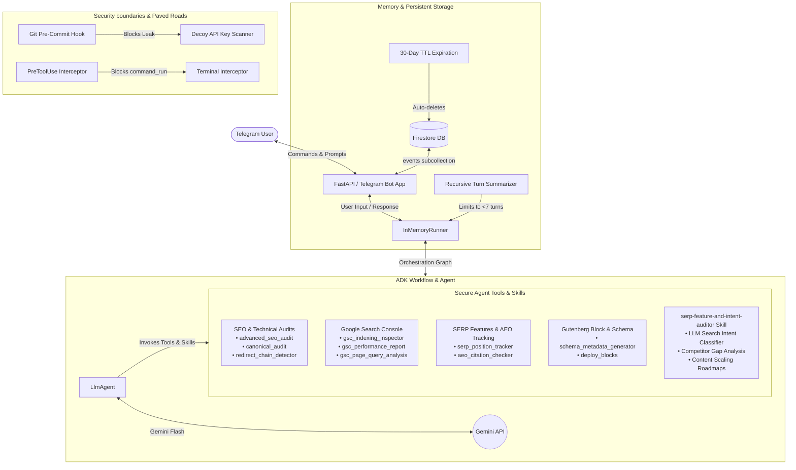

# Gutenberg AEO Copilot Telegram Bot
> **Autonomous WordPress SEO & Answer Engine Optimization (AEO) Auditor**

Gutenberg AEO Copilot Telegram Bot is an autonomous SEO/AEO agent built using the **Google Agent Development Kit (ADK) 2.0**. It helps modern publishers optimize their content for both traditional search engines (SEO) and generative search engines (Answer Engine Optimization / AEO, such as Google AI Overviews / SGE).

This project was built as a Capstone Project for the **5-Day AI Agents Intensive Vibe Coding Course with Google**.

---

## System Architecture



---

## Key Features & Concepts Demonstrated

### 1. Spec-Driven Orchestration & Session Pruning
* Utilizes the `google-adk` framework's `Workflow` and `Edge` graph classes.
* Implements a **Recursive Turn Summarization Engine** that keeps active chat context under **7 turns** to conserve LLM tokens and stay well within Firestore's 1MB cap. Turns older than 7 are summarized down to under 50 words by Gemini and recursively merged with existing summaries.

### 2. Event-Based Firestore Persistence & TTL
* Refactored session storage from a monolithic JSON document to an event-based subcollection: `/telegram_sessions/{chat_id}/events/{event_id}`.
* Automatically stamps each event with a `last_updated` date set to 30 days in the future, allowing Firestore **Time-To-Live (TTL)** deletion jobs to purge stale logs continuously.
* Synchronizes in-memory pruning with the database: obsolete events deleted by the pruner are immediately removed from the Firestore subcollection.

### 3. Custom ADK 2.0 Skill: SERP Feature & Intent Auditor
* **LLM Intent Classification**: Leverages a fast, synchronous Gemini call inside `serp_position_tracker` to classify search query intent (Navigational, Informational, Commercial, Transactional) semantically, bypassing fragile regex matching.
* **Granular Placement Tracking**: Inspects SerpAPI results to track organic positions (1-100), Featured Snippets (Answer Box), PAA cards, Google Ads (sponsored listings, top/bottom blocks), Knowledge Graphs, and Local Map Packs.
* **Cognitive Auditing & Recovery Roadmaps**: 
  * **Inclusion Audits**: Scores the target page's layout alignment against the classified intent (0-100%).
  * **Exclusion Audits**: If a brand is not ranking, the agent inspects the top 3 ranking competitors, diagnoses if exclusion is due to an **Intent Mismatch**, and generates a **Content Scaling Roadmap** suggesting guide titles and PAA question integrations.

### 4. Advanced Technical SEO & Google Search Console Integration
* **Redirect loops & Loops Detector**: Recursively follows redirects (`redirect_chain_detector`) to trace loops, hops, and canonical targets.
* **Canonical cannibalization auditor**: Analyzes list of URLs (`canonical_audit`) to verify canonical tag health and prevent ranking self-cannibalization.
* **GSC Inspector**: Interfaces with Google Search Console APIs to audit indexing status (`gsc_indexing_inspector`), retrieve performance reports (`gsc_performance_report`), and query organic search impressions by page (`gsc_page_query_analysis`).

### 5. Enterprise-Grade Security Paved Roads
* **Pre-Commit Hook**: Git pre-commit hook scanning for hardcoded secrets and API keys using custom Semgrep rules. Includes a Windows-compatible native Python launcher shim inside `.venv`.
* **IDE Gating Hook**: Implements `PreToolUse` hooks (`hooks.json` & `validate_tool_call.py`) to intercept `run_command` calls and prevent dangerous commands from running inside the terminal sandbox.

---

## Installation & Setup

### Prerequisites
* Python 3.10+
* Git
* Firebase/Firestore Project

### Step-by-Step Installation

1. Clone the repository:
   ```bash
   git clone https://github.com/cephasoo/adk-aeo-20.git
   cd adk-aeo-20
   ```

2. Initialize your local virtual environment:
   ```bash
   python -m venv .venv
   .venv\Scripts\activate      # On Windows
   source .venv/bin/activate   # On macOS/Linux
   ```

3. Install dependencies in editable mode:
   ```bash
   pip install -e .
   ```

4. Configure environment variables inside `.env`:
   ```ini
   # Model Credentials
   GEMINI_API_KEY="your_gemini_api_key"
   GEMINI_MODEL="gemini-2.5-flash"
   GOOGLE_CLOUD_PROJECT="your_google_cloud_project_id"

   # Telegram Bot Credentials
   TELEGRAM_BOT_TOKEN="your_telegram_bot_token"

   # WordPress REST API Credentials
   WP_API_URL="http://your-wordpress-domain.local/wp-json/wp/v2"
   WP_USERNAME="your_wordpress_username"
   WP_APPLICATION_PASSWORD="your_wordpress_application_password"

   # Search & AEO Audit Credentials
   SERPAPI_API_KEY="your_serpapi_api_key"

   # Oauth2 Credentials for developer signature bypassing
   DEVELOPER_SECRET_KEY="your_developer_jwt_key"
   ```

5. Install the local git pre-commit hooks:
   ```bash
   pre-commit install
   ```

---

## Running the Bot & Commands

To start the bot in local polling mode:
```bash
python app/main.py
```

Open Telegram and send commands to your configured bot:
*   `/start` - Overview of capabilities and instructions.
*   `/login <token>` - Authenticate your session with developer JWT scopes.
*   `/audit <url_or_id>` - Performs a 19-rule rendered technical SEO and AEO audit and generates the HTML report.
*   `/track <url> | <query>` - Track Google search organic, paid, and feature rankings.
*   `/aeo <url> | <query>` - Check AI Overview citation and calculate SoM.
*   `/redirect <url>` - Analyze redirect chains, loops, and hops.
*   `/canonical <urls_list>` - Check canonical tag paths and duplicate cannibalization.
*   `/schema <id> | <type>` - Generate and inject structured JSON-LD schemas.
*   `/gsc <url>` - Check Google Search Console indexing and performance metrics.
*   `/clear` or `/reset` - Wipes active in-memory session history and recursively deletes all Firestore event documents.

---

## Verification & Testing

To run the unit and integration tests (including the session pruner and event-based persistence tests):
```bash
pytest
```
Or run individual test scripts manually:
*   `python scratch/test_session_summarization.py`
*   `python scratch/test_event_based_storage.py`
*   `python scratch/test_serp_feature_tracking.py`
